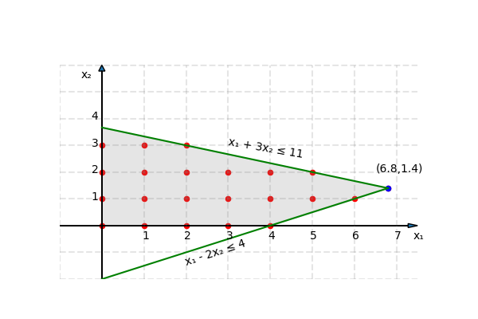
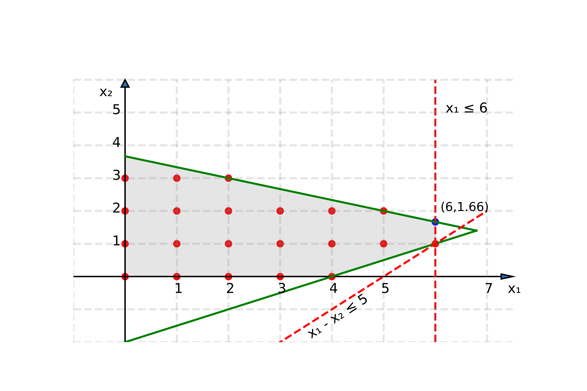
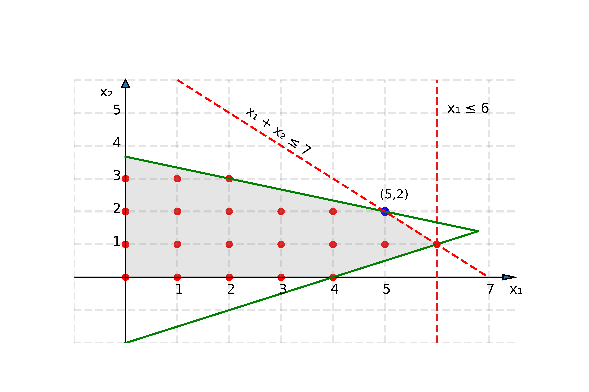

# draw-feasible-region-for-LP-IP
How to nicely sketch feasible region of a linear programming/integer programming problem with python.
Here is a code used for an article published in one of IFORS newsletter conference.
This article compares Gomory cuts, i.e. Gomory fractional cut and Gomory mixed integer cut.

## Scripts
All of the scripts visualize the feasible region of the linear programming relaxation of the integer programming problem.

`LP_relaxation.py` draws the feasible region as

`Gomory_frac_cut.py` draws the feasible region including a Gomory fractional cut as

`Gomory_mixed_integer_cut.py` draws the feasible region including a Gomory mixed integer cut as

